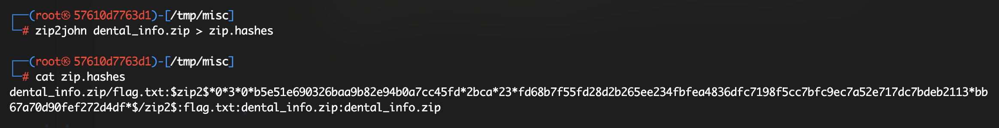

### Challenge:
Challenge files - [Kingply, Reply cybersec challenge 2023](https://challenges.reply.com/tamtamy/challenge/reply-cybersecurity-challenge-2023/detail)

- Was given a text file named email.txt
- contained base64 encoded png and base64 encoded zip
---
- copied receipt png base64 string to receipt.txt and used following terminal command to decode
```
base64 -d -i receipt.txt -o receipt.png
```
- similarly got dental_info.zip which is password protected now i need to find the password
---
- **Stegsolve TOOL** - tool to analyse image by changing RGB channels(didn't got something useful tho)
```
java -jar path\to\stegsolve
java -jar /Users/denshi/Code/CTF/packages/stegsolve/stegsolve.jar
```
---
- ran [[exiftool]] on the receipt image
```
exiftool receipt.png
```
- got password format - `DOBmail***R3ply!`, where(*** means random characters as clarification provided on discord)
- birth date - 02/08/1990 , format for date - YYMMDD(told on discord)
- therefore pwd $\to$ `900802jenfi@veryrealmail.com***R3ply!`
---
- Now used [[JohnTheRipper]] 
- Getting hashes out of zip into a file named `zip.hashes`.
```
zip2john dental_info.zip > zip.hashes
```

- `Mask flag` - Using john on a pre-password format, here we need to bruteforce 3 unknown characters after '.com'.
```
john --mask=900802jfeng@veryrealmail.com?a?a?aR3ply! zip.hashes
```


got the pwd yay!
